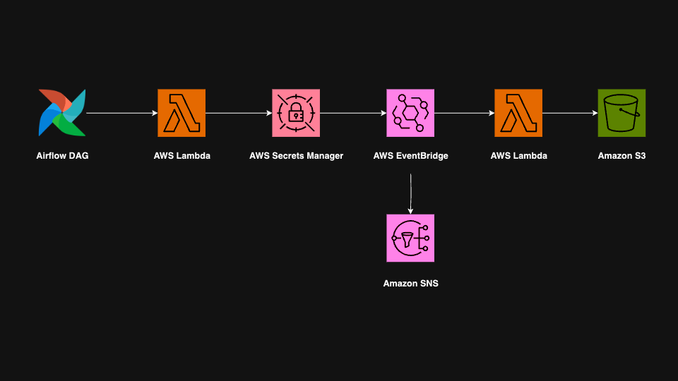

# AWS API Data Collection

## Project Overview
An automated pipeline designed to retrieve, process, and store OAuth keys and API data using AWS services. Built with Airflow, AWS Lambda, Secrets Manager, S3, and SNS.

## Screenshot

## Link to the API
https://api.nsw.gov.au/Product/Index/26
